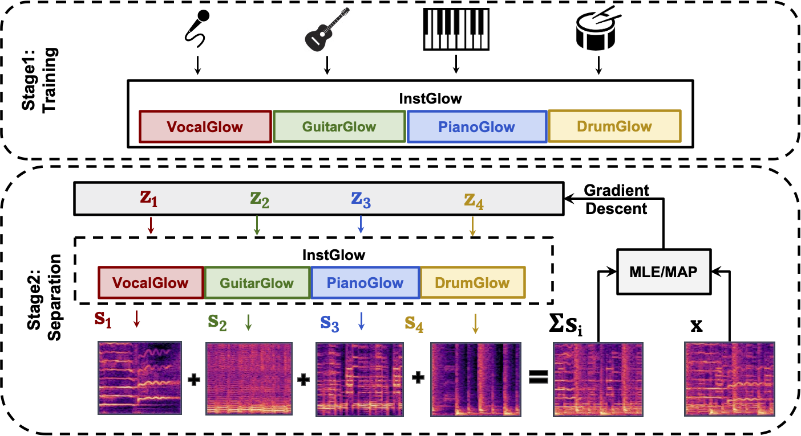

# Generative Source Separation using Glow
Source separation as an inverse problem. Demo page will be released soon.

## Introduction
Music source separation with both paired mixed signals and source signals has obtained substantial progress over the years. However, this setting highly relies on large amounts of paired data. Source-only supervision decouples the process of learning a mapping from a mixture to particular sources into a two stage paradigm: source modeling and separation. In this project, we leverage flow-based implicit generators to train music source priors and likelihood based objective to separate music mixtures.

## requirements
pytorch>=1.5.0\
tqdm\
librosa\
jupyter\
museval\
tqdm\
pandas\
(apex)[https://github.com/NVIDIA/apex]

## Usage
    
### Inference
Run `inference_demo.py` for further details.

## Experimental Results on MusDB
| Method     |Backbone   |  Vocals  | Bass     |Drums     | Other    |
|------------|-----------|----------|----------|----------|----------|
| Demucs(v2) | U-Network |7.14      |5.50      |6.74      |4.16      |
| Conv-TasNet|TCN        |7.00      |4.19      |5.25      |3.94      |
| Open Unmix |BiLSTM     |6.86      |4.88      |6.35      |3.86      |
| Wav-U-Net  | U-Network |5.06      |2.63      |3.74      |1.95      |
| InstGlow   |Glow       |3.92      |2.58      |3.85      |2.37      |

## References

